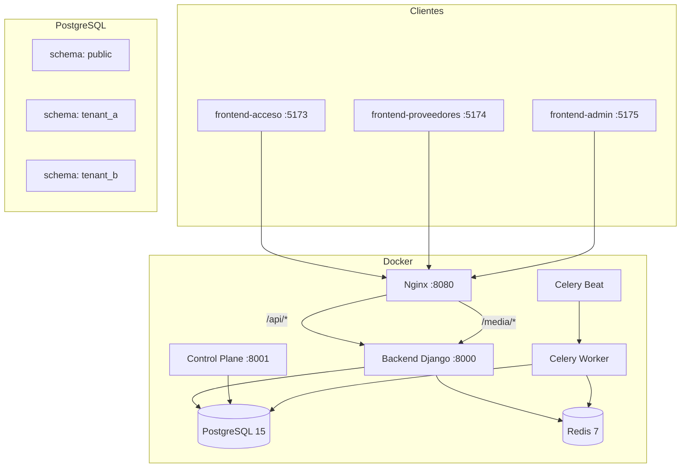
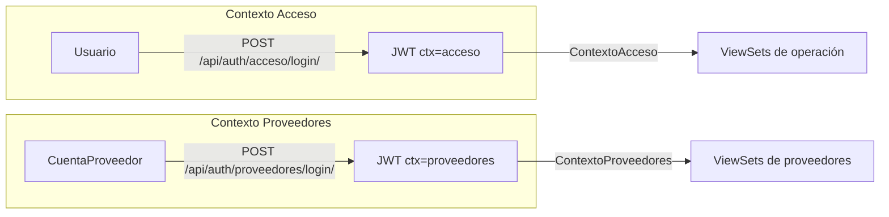

# Arquitectura — Xenty Acceso

## Diagrama general



## Multitenancy

- **Aislamiento por schema PostgreSQL** (django-tenants 3.7.0)
- `TenantMainMiddleware` resuelve tenant por subdominio (primer middleware)
- `SHARED_APPS`: contenttypes, auth, admin, tenants, token_blacklist
- `TENANT_APPS`: accounts, proveedores, empleados, recintos, documentos, eventos, citas, acceso, gafetes, sanciones, dispositivos, mensajeria, cumplimiento, ocr, config, soporte
- Media aislado: `MULTITENANT_RELATIVE_MEDIA_ROOT = "%s"` (schema como directorio)
- Cache aislado: prefijo por schema en Redis

## Dos planos

| Plano | Settings | Schema | Puerto | Función |
|---|---|---|---|---|
| Data plane | `config.settings.dev` | tenant (por subdominio) | 8000 | Operación del recinto |
| Control plane | `config.settings.control_plane` | public | 8001 | Super-admin, billing, provisioning |

## Autenticación (dos contextos JWT)



- JWT access: 8h, refresh: 30d, blacklist + rotación
- Passwords: Argon2id
- MFA: TOTP (pyotp) + WebAuthn (pendiente)
- Claims custom: `ctx` (acceso/proveedores), `mfa` (pending/complete)

## Capas de permisos (orden de evaluación)

| # | Clase | Función |
|---|---|---|
| 1 | `IsAuthenticated` | Sesión válida |
| 2 | `MFASesionCompleta` | MFA no pendiente |
| 3 | `EmailVerificado` | Email verificado |
| 4 | `ContextoAcceso` / `ContextoProveedores` | JWT ctx claim |
| 5 | `RequiereRol(*roles)` | user.rol in roles |
| 6 | `RequiereModulo(modulo)` | Plan del tenant incluye módulo |
| 7 | `RequierePermisoPersonalizado(modulo)` | Permisos granulares para rol=usuario |

## Middleware (orden crítico)

1. `TenantMainMiddleware` — resuelve tenant
2. `RestringirAdminPorIP` — /admin/ por allowlist
3. `EnforceMantenimiento` — 503 en ventana
4. `BloquearTenantsInactivos` — tenant suspendido
5. `BloquearEmailNoVerificado`
6. `BloquearTrialExpirado`
7. `EnforceModoSoloLectura` — 423 en dunning
8. `EnforceMFAFullSession` — 403 si MFA incompleta
9. `CorsMiddleware`
10. Estándar Django

## Flujo de gafete QR

1. `emitir_qr()` → Fernet encrypt `{id, tipo, jti, exp, tenant, ctx}`
2. `componer_gafete()` → PIL genera PNG Premium Dark (340×650–700px)
3. Entrega: email con adjunto PNG o descarga directa desde endpoint
4. Validación: `verificar_qr()` → descifra + valida exp + verifica tenant

## Estructura de URLs del API

```
/api/auth/acceso/login/          → AccesoLoginView
/api/auth/proveedores/login/     → ProveedorLoginView
/api/auth/refresh/               → TokenRefreshView
/api/auth/logout/                → LogoutView
/api/auth/me/                    → MeView
/api/auth/mfa/totp/{enrolar,activar,verificar}/
/api/usuarios/                   → UsuarioViewSet (CRUD + permisos action)
/api/empleados/                  → EmpleadoViewSet (CRUD + importar)
/api/recintos/                   → RecintoViewSet + Zona, Acceso, etc.
/api/eventos/                    → EventoViewSet + proveedores
/api/citas/                      → CitaViewSet + asistentes + contactos
/api/accesos/                    → RegistroAccesoViewSet + scanner
/api/sanciones/                  → SancionViewSet
/api/mensajeria/                 → MensajeWhatsAppViewSet
/api/documentos-empleado/        → DocumentoEmpleadoViewSet
/api/tipos-documento/            → TipoDocumentoViewSet
/api/config/opciones/            → OpcionViewSet
/api/config/historial/           → HistorialCambioViewSet
```

## Mapa de archivos clave

| Área | Archivo |
|---|---|
| Settings | `backend/config/settings/{base,dev,prod,control_plane}.py` |
| URLs data plane | `backend/config/urls.py` |
| URLs control plane | `backend/config/urls_public.py` |
| Permisos | `backend/common/permissions.py` |
| Auth JWT custom | `backend/common/auth_api.py` |
| MFA | `backend/common/mfa_api.py` |
| Crypto (Fernet) | `backend/common/crypto.py` |
| Validators | `backend/common/validators.py` |
| Auditoría | `backend/apps/config/services.py` |
| Gafetes QR | `backend/apps/gafetes/services.py` |
| Emails HTML | `backend/common/email.py` (construir_correo) |
