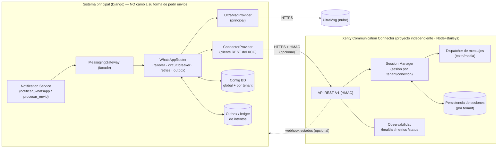
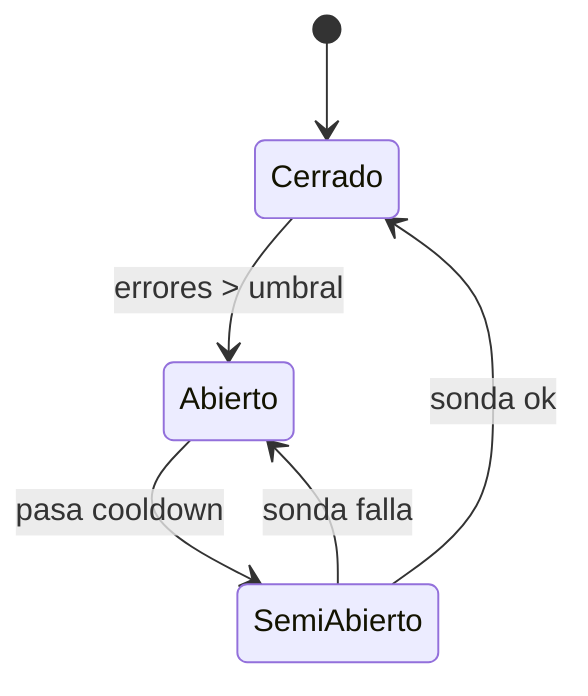

# Arquitectura — Xenty Communication Connector (XCC)

> **Estado: PROPUESTA para aprobación.** Ninguna línea de código del Connector ni de la integración
> se ha escrito aún. Este documento es el diseño a aprobar antes de implementar (protocolo de
> checkpoint, CLAUDE.md §5).
>
> Autor: Arquitectura · Fecha: 2026-07-03 · Versión: 0.1 (borrador para revisión)

---

## 0. Resumen ejecutivo (TL;DR)

- **Qué**: un servicio **independiente y opcional** —**Xenty Communication Connector (XCC)**— que
  actúa como **proveedor local de WhatsApp de respaldo (failover)** frente al proveedor principal
  actual (UltraMsg). Diseñado como **conector multicanal** (WhatsApp hoy; SMS/Telegram/email a
  futuro) sin reescribir nada.
- **Cómo se integra**: el sistema principal **nunca** conoce al Connector directamente. Habla con una
  **abstracción** (`ProveedorMensajeria`) orquestada por un **Router de failover**. El Connector es
  solo *otro proveedor* detrás de esa interfaz. Si no existe/está apagado, el sistema funciona
  **exactamente igual que hoy**.
- **Transporte**: **REST/HTTP versionado + HMAC** (mismo patrón que el edge del proyecto) para el
  envío, y **webhook opcional** para estados de entrega. Justificación en §5.
- **Tecnología del Connector**: **Node.js + Baileys** (WhatsApp Web multi-device). Es la única vía
  madura para sesiones locales con QR/pairing/reconexión; Python no tiene equivalente. Por eso es un
  proyecto aparte (runtime distinto) — lo que además **refuerza el desacoplamiento**.
- **Config sin archivos**: toda la administración (global y por-tenant) se hace desde la **UI**
  (super-admin global + preferencia por tenant), persistida en BD.
- **Sin pérdida de mensajes**: **outbox + ledger de intentos** + reintentos por Celery + circuit
  breaker; degradación controlada y recuperación automática.

**Propuesta de nombre definitivo**: `Xenty Communication Connector` (XCC). Genérico y multicanal.

---

## 1. Análisis del sistema actual (punto de partida real)

Verificado en código (`apps/mensajeria`):

| Elemento | Hoy | Rol en la integración |
|---|---|---|
| `notificar_whatsapp(tel, cuerpo, archivo)` | Punto único para notificaciones sueltas; *best-effort*, nunca lanza | **Seam** a preservar (firma estable) |
| `obtener_whatsapp()` | Factory → `UltraMsgWhatsApp` \| `SandboxWhatsApp` | **Abstracción implícita** (`.enviar()`). La formalizamos |
| `procesar_envio(mensaje_id)` | Envío de campañas por Celery, itera `DestinatarioMensaje` | Pasa a usar el Router |
| `Mensaje` / `DestinatarioMensaje` | Modelos de campaña + `external_id` | Se enriquecen con proveedor usado y ledger |
| Credenciales | `ULTRAMSG_*` por `settings`/env | Migran a config administrable (global + tenant) |
| `_enviar_whatsapp` en `eventos/services.py` | Wrapper duplicado del helper | Se unifica en el Gateway |

**Observaciones de arquitecto:**
1. Ya existe una **interfaz de facto** (`.enviar()`): el cambio es evolutivo, no disruptivo.
2. La lógica de envío está **dispersa** (mensajeria + un wrapper en eventos). Oportunidad de
   consolidar en un **Messaging Gateway** único (facade).
3. El proyecto ya domina patrones reutilizables: **HMAC + nonce anti-replay** (edge), **modo
   sandbox** detrás de interfaz (Stripe/UltraMsg/Mesa), **config por tenant** (`ConfiguracionMesa`),
   **panel super-admin** (control plane). El diseño **reutiliza** todos.

---

## 2. Objetivos y restricciones (contrato de la solución)

**Debe cumplir:**
- Dependencia **opcional**: instalar / no instalar / actualizar / reiniciar / escalar / mover de
  servidor **sin afectar** al sistema principal.
- El principal solo conoce **una abstracción**, jamás la implementación del Connector.
- **Multi-tenant** con aislamiento total (nunca mezclar información entre tenants).
- Administración **por UI** (global super-admin + por-tenant), sin tocar archivos.
- **Failover** transparente desde el Notification Service, sin pérdida de mensajes.
- Connector autónomo: sesiones, QR, pairing, reconexión, persistencia, media, monitoreo.
- Escalable a **cientos de sesiones**. Observabilidad completa.
- Evolutivo por **años**, con mínimo acoplamiento.

**No-objetivos (de esta fase):** mensajería entrante/bots, campañas masivas desde el Connector,
canales distintos a WhatsApp (se dejan *habilitados por diseño*, no implementados).

---

## 3. Decisión de arquitectura (visión)



**Regla de oro:** el Connector es *un proveedor más* detrás del Router. Quitarlo = el Router se queda
con un solo proveedor (UltraMsg) = comportamiento actual intacto.

---

## 4. Responsabilidades por componente

### 4.1 Sistema principal (Django)
- **Notification Service** (`notificar_whatsapp`, `procesar_envio`): **único punto de entrada**. No
  cambia su firma pública. Solo delega en el Gateway.
- **MessagingGateway** (nuevo, facade): unifica el envío (consolida el wrapper duplicado de eventos).
  Traduce “notificación de dominio” → “solicitud de mensaje”.
- **WhatsAppRouter** (nuevo, orquestador): selecciona proveedores por config de tenant, aplica
  **prioridad, timeout, reintentos, circuit breaker, failover y recuperación**; registra cada intento
  en el **outbox/ledger**; nunca pierde un mensaje (si todos fallan → encolado para reintento).
- **ProveedorMensajeria** (interfaz/Protocol): contrato estable `enviar(mensaje) -> Resultado`.
  Implementaciones: `UltraMsgProvider` (existente, refactor mínimo) y `ConnectorProvider` (cliente
  REST del XCC). **Registro de proveedores** para añadir otros sin tocar el Router.
- **Config** (BD, administrable por UI): global (control plane) + por-tenant.

### 4.2 Xenty Communication Connector (proyecto independiente)
- **API REST /v1** con **HMAC + nonce** y *scoping* por tenant. Contrato **channel-agnostic**.
- **Session Manager**: ciclo de vida de sesiones WhatsApp por `(tenant, conexión)`: creación, **QR /
  pairing code**, reconexión con backoff, recuperación tras reinicio, cierre.
- **Dispatcher**: envío de **texto, enlaces, imagen, documento (PDF/Word/Excel), audio, video,
  archivos**. Acepta URL o carga directa; valida tipo/tamaño.
- **Persistencia**: credenciales/estado de sesión por tenant (aislado). Sobrevive reinicios.
- **Observabilidad**: `/healthz`, `/metrics` (Prometheus), `/status` (estado por sesión), logs
  estructurados, auditoría, estadísticas.

---

## 5. Decisión de transporte: REST + HMAC (con webhook opcional)

Evaluado contra los objetivos (opcionalidad, desacople, movilidad, ops):

| Opción | Pro | Contra | Veredicto |
|---|---|---|---|
| **REST/HTTP + HMAC** | El principal ya habla HTTP (DRF/requests); simétrico con UltraMsg; **opcional trivial** (si la URL no responde → failover); mover a otro servidor = cambiar URL; sin infra extra | Estados de entrega requieren webhook/polling | **ELEGIDA** |
| gRPC | Contrato fuerte, streaming | Tooling proto, dependencia persistente, más acoplamiento y ops; poco valor aquí | No |
| Mensajería (broker) | Desacople temporal, buffering | **Broker obligatorio** compartido ⇒ rompe “independiente/opcional” y complica mover/instalar | No (se puede añadir a futuro como transporte alterno) |
| Eventos | Bueno para asíncrono | Igual que broker; innecesario para envío puntual | No |

**Justificación:** REST es la opción que **maximiza la opcionalidad y la independencia** (el requisito
duro). El **HMAC + nonce** replica el patrón edge ya probado en el proyecto (autenticación fuerte sin
sesión, anti-replay). Los **estados de entrega** (delivered/read) llegan por **webhook opcional**; si
no se configura, el sistema degrada a “enviado (aceptado por el Connector)”. El **contrato REST es
versionado** (`/v1`) para evolucionar sin romper compatibilidad.

### Contrato REST (borrador, channel-agnostic)
```
POST /v1/messages
  headers: X-XCC-Timestamp, X-XCC-Nonce, X-XCC-Signature (HMAC-SHA256), X-XCC-Tenant
  body: { channel:"whatsapp", connection_id, to, type:"text|image|document|...",
          text?, media_url?|media_b64?, filename?, caption? }
  -> 202 { message_id, status:"accepted", provider:"xcc" }

GET  /v1/health            -> estado del servicio
GET  /v1/tenants/{t}/sessions           -> sesiones y su estado
POST /v1/tenants/{t}/sessions           -> crear sesión
GET  /v1/tenants/{t}/sessions/{id}/qr   -> QR / pairing code
POST /v1/tenants/{t}/sessions/{id}/logout
(webhook opcional) POST {callback_url}  -> { message_id, status:"delivered|read|failed" }
```

---

## 6. Integración sin acoplamiento (el seam)

```mermaid
sequenceDiagram
  participant Dom as Código de dominio (citas/eventos/…)
  participant NS as Notification Service
  participant RT as WhatsAppRouter
  participant P1 as UltraMsg (principal)
  participant P2 as ConnectorProvider→XCC
  participant OBX as Outbox/ledger

  Dom->>NS: notificar_whatsapp(tel, cuerpo, archivo)
  NS->>RT: enviar(Mensaje, tenant)
  RT->>OBX: registrar intento (pendiente)
  alt breaker P1 cerrado
    RT->>P1: enviar (timeout T1)
    P1-->>RT: ok / error
  end
  alt P1 falló y hay secundario habilitado
    RT->>P2: enviar (timeout T2)
    P2-->>RT: ok / error
  end
  RT->>OBX: resultado (enviado/fallido + proveedor)
  RT-->>NS: Resultado (best-effort; nunca lanza)
```

- El dominio y el Notification Service **no cambian** (firma `notificar_whatsapp` intacta).
- Si el Connector no está configurado, el Router **solo tiene UltraMsg** → flujo idéntico a hoy.
- La opcionalidad es **estructural**: `ConnectorProvider` se registra **solo si** hay config global
  habilitada; su ausencia no es un error.

---

## 7. Multi-tenant y aislamiento

- **Connector**: toda operación lleva `tenant` (header + firma). Sesiones, persistencia y logs
  **particionados por tenant**; nunca se resuelven credenciales/sesiones fuera del tenant del
  request. Un tenant puede tener **múltiples conexiones/sesiones**.
- **Principal**: la preferencia de mensajería vive por tenant (schema del tenant o tabla pública
  keyed por tenant, a decidir en §12). El Router siempre opera dentro del `tenant_context`.
- **Verificación**: se extiende la suite `pytest -k aislamiento` para cubrir que la preferencia y el
  ruteo de un tenant no filtran a otro.

---

## 8. Configuración por UI (sin archivos)

### 8.1 Global — Super-admin (control plane, `frontend-admin` → nueva sección “Comunicaciones”)
`ConfiguracionConnector` (schema public):
`habilitado`, `url_base`, `hmac_secret` (cifrado Fernet), `timeout_ms`, `intervalo_health`,
`prioridad_default`, `reintentos_default`, `estrategia_failover`, umbrales de circuit breaker,
`recuperacion_automatica`.

### 8.2 Por-tenant — Admin del tenant (`frontend-acceso` → “Mensajería · Proveedores”)
`PreferenciaMensajeria` (por tenant):
`proveedores_orden` (p. ej. `["ultramsg","xcc"]` o `["xcc"]` o `["ultramsg"]`),
`failover_habilitado`, `reintentos`, `timeout_ms`, override de prioridad.

**Precedencia:** master switch global → default global → **override por tenant**. Todo editable en
UI; **cero cambios de archivo** para operar (las credenciales *secretas* se guardan cifradas, no en
env).

---

## 9. Failover, resiliencia y “no perder mensajes”

Patrones aplicados (en el Router):
- **Provider registry + strategy**: lista ordenada por tenant.
- **Circuit breaker** por proveedor (cerrado→abierto→semiabierto) alimentado por health checks y
  errores; un proveedor con breaker abierto se **salta**.
- **Retries con backoff** dentro de un proveedor; luego **failover** al siguiente.
- **Timeout** por intento (config).
- **Outbox pattern + ledger de intentos**: cada envío se persiste antes de intentar; si todos los
  proveedores fallan, queda **encolado** (Celery beat lo reintenta) → *degradación controlada*, **no
  se pierde**.
- **Recuperación automática**: sonda *half-open* reincorpora un proveedor al recuperarse.



---

## 10. El Connector por dentro (Node + Baileys)

- **API** (Fastify/Express) → **Auth HMAC/nonce** → **Session Manager** → **Dispatcher** →
  **Store**.
- **Session Manager**: registro en memoria + `useMultiFileAuthState`/store en BD por tenant;
  **lazy-load**, reconexión con backoff exponencial, *keep-alive*, límite de sesiones por worker.
- **Escalabilidad (cientos de sesiones)**: afinidad de sesión por `connection_id` si se escala
  horizontalmente (routing sticky); colas por sesión (backpressure); métricas de memoria/CPU;
  recuperación tras reinicio desde el store.
- **Media**: texto/enlace/imagen/documento(PDF/Word/Excel)/audio/video/archivo; por URL o carga;
  validación de tipo/tamaño.
- **Persistencia**: PostgreSQL (metadatos + credenciales de sesión cifradas) y/o volumen por tenant;
  aislado por tenant.

---

## 11. Observabilidad

- **Logs estructurados** (JSON) en ambos lados, sin PII (se reutiliza el criterio de redacción del
  principal).
- **Métricas** Prometheus (`/metrics`): mensajes por proveedor/tenant, latencias, tasa de error,
  estado de breaker, sesiones activas/caídas.
- **Health**: `/healthz` (servicio) + `/status` por sesión; el principal ya tiene `/health/ready`.
- **Auditoría**: quién envió, a quién, por qué proveedor, resultado (ledger).
- **Estadísticas** para la UI (dashboard de comunicaciones).

---

## 12. Riesgos y mitigaciones

| Riesgo | Mitigación |
|---|---|
| **Baileys es no-oficial** (WhatsApp puede bloquear) | Es **respaldo**, no principal; aislar por tenant/número; monitorear baneos; mantener UltraMsg como primario |
| Sesiones locales frágiles (reconexión) | Reconexión con backoff + persistencia + `/status` + alertas |
| Fuga cross-tenant | Scoping por tenant en API/store/logs + suite de aislamiento |
| Acoplamiento accidental | El principal solo conoce la interfaz; contrato REST versionado; el XCC no importa nada del principal |
| Pérdida de mensajes en caída total | Outbox + reintentos Celery + degradación controlada |
| `PreferenciaMensajeria` ¿schema tenant o público? | **Decisión abierta** (ver §16) |
| Secreto HMAC | Cifrado Fernet en BD; rotación soportada |
| Runtime nuevo (Node) en ops | Contenedor propio; opcional; no toca el runtime del principal |

---

## 13. Plan de crecimiento (años)
- **Multicanal**: el contrato `channel` ya lo permite → SMS/Telegram/email como nuevos dispatchers
  del XCC y/o nuevos `ProveedorMensajeria` en el principal.
- **Mensajería entrante / webhooks bidireccionales** (respuestas, bots) — el webhook ya está previsto.
- **Transporte alterno** (broker/eventos) si el volumen lo exige, sin cambiar el Gateway.
- **Escala horizontal** del XCC con routing sticky.

---

## 14. Despliegue, actualización y rollback
- **Despliegue**: XCC como **servicio/contenedor propio** (compose service o repо separado), con su
  BD/volumen. Puede vivir en otro servidor (solo cambia `url_base` en la UI).
- **Actualización**: rolling/blue-green del XCC; el principal no se entera (breaker + failover cubren
  la ventana). Contrato `/v1` estable; cambios incompatibles → `/v2`.
- **Rollback instantáneo**: **toggle global “deshabilitar Connector”** en la UI → el Router deja de
  usarlo al instante, sin desplegar nada. Rollback de versión = redeploy del contenedor XCC.
- **Instalar/desinstalar**: instalar = levantar el XCC + habilitar en UI; desinstalar = deshabilitar
  en UI + apagar el contenedor. El principal sigue igual.

---

## 15. Fases de implementación propuestas (tras aprobación)
1. **F-A · Seam en el principal (sin XCC aún):** formalizar `ProveedorMensajeria`, `MessagingGateway`,
   `WhatsAppRouter` con **solo UltraMsg** + outbox/ledger + circuit breaker. *Comportamiento idéntico
   a hoy, ya con failover-ready.* Tests + aislamiento.
2. **F-B · Config por UI:** `ConfiguracionConnector` (global, super-admin) + `PreferenciaMensajeria`
   (tenant) + pantallas.
3. **F-C · Connector (MVP):** proyecto Node+Baileys, API REST+HMAC, 1 sesión/tenant, texto+documento,
   QR/pairing, persistencia, `/healthz`+`/status`.
4. **F-D · `ConnectorProvider` + failover real** enchufado al Router; pruebas de failover E2E.
5. **F-E · Media completa, métricas, webhook de estados, escalado**.

Cada fase es un checkpoint independiente y **entregable** (el principal nunca queda roto).

---

## Estado de implementación
- **F-A · Seam en el principal:** ✔ hecho (proveedor tras interfaz + Router + breaker + ledger).
- **F-B · Config por UI:** ✔ hecho (2026-07-03). `ConfiguracionConnector` (global, super-admin, master
  switch + umbrales) y `PreferenciaMensajeria` (por tenant, orden de proveedores + failover). Router
  lee ambas: precedencia master switch global → preferencia del tenant; `xcc` se salta si el switch
  global está apagado o si aún no hay `ConnectorProvider` registrado. APIs
  `/api/admin/comunicaciones/` (control plane) y `/api/mensajeria/preferencia/` (tenant, admin);
  pantallas "Comunicaciones" (frontend-admin) y "Mensajería · Proveedores" (frontend-acceso). Tests:
  router 9 + aislamiento de preferencia 1. Comportamiento previo intacto (Connector aún no existe).
- **F-C · Connector (MVP):** ✔ hecho (2026-07-03). Repo **separado** `xenty-connector` (Node 20 +
  TypeScript + Fastify + Baileys). API REST `/v1` con HMAC+nonce (paridad con el edge; cadena de firma
  documentada para que F-D la calque), sesiones por `(tenant, connection_id)` con QR/pairing +
  reconexión con backoff + recuperación tras reinicio, media completa (texto/imagen/documento/audio/
  video/archivo por URL o b64 con validación de tamaño), persistencia por tenant, `/healthz` +
  `/v1/health` + `/v1/status`, logs estructurados sin PII. Tests 15 (hmac/media/servidor). Verificado
  en Docker: healthz 200, 401 sin firma, 409 con firma válida sin sesión, y **QR real generado** al
  crear sesión. Contrato y esquema HMAC en `xenty-connector/README.md`.
- **F-D · `ConnectorProvider` + failover real:** ✔ hecho (2026-07-03).
  `apps/mensajeria/connector_provider.py` = cliente REST del XCC (firma HMAC idéntica a la que valida
  el Connector), registrado en `proveedores.registro_proveedores`. El Router ya lo ordena por
  preferencia del tenant y lo gatea con el master switch. **Nunca lanza** → failover a UltraMsg/Sandbox
  ante caída. Tests: 5 (firma, sin config, HTTP≠202, registro, **failover xcc→sandbox**). Interop en
  vivo verificada: `ConnectorProvider` de Django firmó contra el XCC en Docker y el Connector aceptó la
  firma (409 por sesión inexistente, no 401). `connection_id` por defecto `"principal"`.
- **F-E:** en progreso.
  - **Nonce en Redis:** ✔ hecho (2026-07-13). `xenty-connector` commit `cd2c85e`. El anti-replay del
    Connector pasa de un `Map` en proceso a una interfaz `NonceStore` con dos implementaciones
    (`InMemoryNonceStore` / `RedisNonceStore`) elegidas por `XCC_REDIS_URL`. Redis usa `SET NX PX`
    atómico compartido → habilita **varias réplicas** del Connector sin aceptar replays entre ellas.
    Fail-closed: si Redis no responde, `/v1` responde `503` y el Router del principal hace failover.
    `docker-compose` del connector incluye ahora su propio Redis. Tests 20 (incl. integración contra
    Redis real, gated por `XCC_TEST_REDIS_URL`).
  - **Pendiente:** métricas Prometheus (`/metrics`), webhook de estados de entrega, routing sticky por
    `connection_id`, `connection_id` configurable por tenant, **crear repo remoto del connector** y
    deploy.

## 16bis. Decisiones tomadas (aprobado 2026-07-03)
- **Arquitectura APROBADA.** Se implementa empezando por **F-A** (seam en el principal, solo UltraMsg).
- **Nombre**: Xenty Communication Connector (XCC). **Transporte**: REST+HMAC. **Runtime**: Node+Baileys.
- **Repositorio del XCC**: **separado** (máxima independencia).
- **`PreferenciaMensajeria`**: en el **schema del tenant**.
- **MVP del Connector (F-C)**: **media completa** desde el inicio.

## 16. Decisiones abiertas (histórico — ya resueltas en §16bis)
1. **Nombre**: ¿`Xenty Communication Connector (XCC)`? (recomendado)
2. **Transporte**: confirmar **REST+HMAC** (recomendado) vs gRPC/mensajería.
3. **Runtime del Connector**: confirmar **Node.js + Baileys** (única vía madura para WA Web local).
4. **Repositorio**: ¿repo **separado** (máxima independencia) o carpeta hermana en el monorepo
   (`connector/`) desplegada aparte? (recomiendo repo separado; carpeta hermana si prefieres un solo
   origen de versión).
5. **`PreferenciaMensajeria`**: ¿en schema del tenant (coherente con el data plane) o en `public`
   keyed por tenant (más simple de administrar desde super-admin)? (recomiendo **schema del tenant**).
6. **Alcance del MVP (F-C)**: ¿texto+documento primero, o media completa desde el inicio?

---

## 17. Por qué esta arquitectura es “para años”
- **Desacople real**: runtimes distintos, contrato versionado, dependencia opcional por diseño.
- **Punto de cambio único**: añadir proveedores/canales = registrar una implementación; el dominio no
  se toca.
- **Operología simple**: sin broker obligatorio; mover/instalar/apagar sin afectar al principal.
- **Reutiliza lo probado**: HMAC+nonce, sandbox tras interfaz, config por tenant, panel super-admin,
  Celery con reintentos, suite de aislamiento.
- **Falla en seguro**: outbox + breaker + toggle de apagado ⇒ nunca tumba la operación ni pierde
  mensajes.

*Fin de la propuesta. Requiere aprobación (§16) antes de implementar (§15).*
